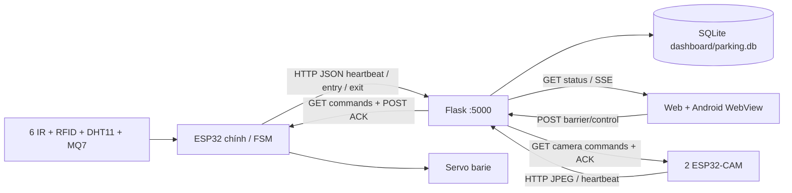

# PHÂN TÍCH DỰ ÁN SMART PARKING IoT

Ngày khảo sát: **09/10/2026**, giờ Việt Nam. Phạm vi: mã nguồn, cấu hình, nội dung tài liệu, SQLite mở bằng `mode=ro`, thông tin mạng trên PC và bốn loại lệnh ADB được cho phép. **Chỉ tạo báo cáo này; không sửa code, chạy backend, build, cài/gỡ app, gửi telemetry hay điều khiển thiết bị.**

Quy ước: ✅ Hoàn thành & chạy được trong phạm vi đã quan sát; 🟡 Có code nhưng chưa tích hợp/chưa kiểm chứng; 🔴 Chưa làm/chỉ có khung hoặc luồng hiện tại bị chặn; ⚪ Không xác định được. Các % là **ước lượng mức sẵn sàng demo của reviewer**, không phải tỷ lệ test pass hay số dòng code hoàn thành. Không gán ✅ cho tính năng phần cứng chỉ dựa vào code hoặc dữ liệu DB cũ.

## 1. Tóm tắt điều hành

1. Hệ thống có firmware ESP32 chính, hai ESP32-CAM, Flask/SQLite, web và Android Java WebView; bằng chứng: `Smart_Parking_IoT.ino:11`, `dashboard/backend/app.py:7`, `android/app/src/main/java/com/smartparking/iot/MainActivity.java:18`.
2. Mức sẵn sàng demo ước lượng **45,25%** theo bảng trọng số mục 5; chưa chứng minh được một vòng end-to-end trên phần cứng hiện tại.
3. Kết luận: **Kịp nếu cắt giảm** xuống demo LAN, RFID, bốn ô đỗ, barie và snapshot camera; phụ thuộc phần cứng đã lắp và nhóm có thể làm song song.
4. Ưu tiên 1: khôi phục controller web: bản nguồn `dashboard/frontend/js/app.js:1` chỉ có 41 dòng, thiếu đăng nhập/realtime; hai bản đóng gói còn 939 dòng.
5. Ưu tiên 2: thống nhất IP và đưa backend lên LAN: PC có Ethernet `192.168.0.103`, không có listener TCP 5000; code đang trỏ `10.27.242.31`.
6. Ưu tiên 3: sửa an toàn tự đóng barie, liên kết RFID–ô đỗ và thống nhất thời điểm tính phí; bằng chứng tại mục 4 và 6.
7. ADB thấy `RF8X11DT20B` ở trạng thái `device`; đã cài `com.smartparking.iot` v1.0.0. Framework xác định từ repo là **Java + Android WebView + HTML/CSS/JS**.
8. Chưa xác minh API thực tế của APK đang cài hoặc lỗi kết nối riêng của app: log hiện có không cung cấp request/console đủ để kết luận; API theo mã nguồn được liệt kê ở mục 4B.

## 2. Kiến trúc & luồng dữ liệu

### 2.1. Cấu trúc đã khảo sát

Cây rút gọn, bỏ `.git`, `build`, `__pycache__`, môi trường ảo và thư viện sinh tự động; các nhánh chứa bản sao tài nguyên được ghi rõ:

```text
Smart_Parking_IoT/
├── Smart_Parking_IoT.ino
├── src/
│   ├── config/       config.h, pins.h
│   ├── sensors/      parking_sensors.*, dht11.*, mq7.*
│   ├── actuators/    barriers.*, buzzer.*, neopixel.*
│   ├── rfid/         rfid_manager.*
│   ├── display/      lcd_manager.*
│   ├── network/      wifi_manager.*
│   └── parking/      parking_fsm.*
├── esp32cam_entry/esp32cam_entry.ino
├── esp32cam_exit/esp32cam_exit.ino
├── dashboard/
│   ├── backend/      app.py, db.py, anpr_engine.py, uploads/
│   ├── frontend/     index.html, js/{app,mobile}.js, css/, icons/, sw.js,
│   │                 manifest.json, _redirects
│   ├── parking.db    DB thực tế theo db.py
│   └── test_telemetry.py
├── android/app/src/main/
│   ├── java/com/smartparking/iot/MainActivity.java
│   ├── AndroidManifest.xml
│   ├── assets/       bản sao frontend
│   └── res/          icon, strings, styles, network_security_config.xml
├── dist/             bản sao frontend để triển khai tĩnh
├── test/test_gpio_static.py
├── run_dashboard.py, build.js, build_apk.py, make_icons.py
├── package.json, netlify.toml, .env, .env.example, .gitignore
├── README.md, MOBILE_SETUP.md, Báo cáo NHUNGiot.docx
└── parking.db        file gốc 0 byte, không phải DB backend đang tham chiếu
```

### 2.2. Công nghệ và khả năng tái lập

| Thành phần | Công nghệ thực tế / phiên bản | Bằng chứng và giới hạn |
|---|---|---|
| ESP32 chính | Arduino C++; WiFi, HTTPClient, ArduinoJson, ESP32Servo, MFRC522, DHT, LiquidCrystal_I2C, Adafruit_NeoPixel | Các header `src/network/wifi_manager.h:4`, `src/actuators/barriers.h:5`, `src/rfid/rfid_manager.h:6`, `src/sensors/dht11.h:5`, `src/display/lcd_manager.h:6`, `src/actuators/neopixel.h:5`. Boot in Version 8.1 tại `Smart_Parking_IoT.ino:68`; chưa xác minh firmware đã nạp. Không tìm thấy manifest khóa phiên bản Arduino/core/library trong cây khảo sát. |
| Hai camera | Arduino, `esp_camera.h`, WiFi, HTTPClient; AI-Thinker | `esp32cam_entry/esp32cam_entry.ino:17`, `esp32cam_exit/esp32cam_exit.ino:17`; snapshot JPEG, không có server stream video trong hai sketch. |
| Backend/DB | Python, Flask, flask-cors, PyJWT, SQLite, python-dotenv | `dashboard/backend/app.py:7`, `dashboard/backend/db.py:6`, `run_dashboard.py:18`. Python được chọn trên PC là 3.14.6; metadata cho Flask 3.1.3, flask-cors 6.0.5, PyJWT 2.13.0, python-dotenv 1.2.2. Đây là môi trường shell hiện tại, chưa chứng minh là môi trường demo. |
| Web/PWA | HTML/CSS/JavaScript thuần, SSE và polling trong bản đóng gói | `dist/js/app.js:236`; `dashboard/frontend/sw.js:1`, `dashboard/frontend/manifest.json:1`. `package.json:3` ghi 8.2.0; không có dependency web trong package này. Node đang có v24.13.0. |
| Android | Activity Java + WebView tải asset HTML; bridge rung/toast/backend URL | `MainActivity.java:18`, `:40`, `:67`, `:102` trong nhánh Java trên. Manifest v1.0.0, minSDK 24, targetSDK 34 (`AndroidManifest.xml:3`). Script build thủ công dùng SDK `F:\ADROI`, build-tools 34.0.0 và android-35 (`build_apk.py:15`). Chưa chạy build để xác nhận tương thích toolchain. |
| ANPR | Pillow + pytesseract/EasyOCR tùy có cài | `dashboard/backend/anpr_engine.py:13`, `:32`. Pillow metadata 12.3.0; **không tìm thấy pytesseract/easyocr trong Python hiện tại**. Chưa kiểm chứng môi trường Python khác, model hoặc ảnh thật. |
| Triển khai | Flask LAN; build sao chép frontend ra dist; Netlify cấu hình tĩnh | `run_dashboard.py:43`, `build.js:4`, `netlify.toml:3`. Không xác minh site đang deploy. |

Không tìm thấy `requirements.txt`, `pyproject.toml`, `platformio.ini`, `pubspec.yaml` hoặc cấu hình React Native trong danh sách file khảo sát. Các phiên bản Python ở trên được đọc bằng `importlib.metadata.version`, không import backend/OCR. `.env.example:6` khai báo DATABASE_PATH nhưng `db.py:6` dùng đường dẫn cố định `dashboard/parking.db`; UPLOAD_FOLDER cũng không quyết định vị trí thực tế (`anpr_engine.py:15`).

### 2.3. Luồng dữ liệu dự kiến và phần hiện có



HTTP/REST chạy qua WiFi LAN; realtime về UI dùng SSE trong **dist/Android**, có fallback polling 2,5 giây (`dist/js/app.js:263`). Không thấy MQTT, Firebase hay WebSocket trong các đường giao tiếp đã đọc. Serial 115200 phục vụ debug/test console (`Smart_Parking_IoT.ino:63`), không phải cầu nối dữ liệu backend.

**Điểm đứt gãy được chứng minh:** Flask phục vụ `dashboard/frontend` (`app.py:45`, `:660`), trong khi controller nguồn thiếu toàn bộ vòng đời ứng dụng. Sensor occupancy có đường lên DB, nhưng UID/slot/time ở FSM chưa được truyền lên; xem mục 4.

### 2.4. Hợp đồng giao tiếp hai đầu

Host trong ESP32, hai camera và native bridge đều là **http://10.27.242.31:5000** (`src/config/config.h:107`, hai camera `:28`, `MainActivity.java:103`). Host đang hiện diện trên Ethernet PC là **192.168.0.103**; không có IP 10.27.242.31 trong snapshot `Get-NetIPAddress`. Đây là sự lệch cấu hình hiện tại, không đủ bằng chứng để khẳng định IP nào đã dùng trong lần demo trước.

| Bên gửi/nhận | Endpoint và payload | Đối chiếu |
|---|---|---|
| ESP32 → Flask | POST `/api/telemetry/heartbeat`; `slots:{P1:0/1,...P4}`, `temp`, `hum`, `gas`, `gasLevel`, `barrierEntry`, `barrierExit`, `freeSlots` | Khớp tên/kiểu với `wifi_manager.cpp:163` và `app.py:168`; heartbeat 3s ở `config.h:111`. Backend ép int/float nhưng thiếu kiểm tra giới hạn và ngoại lệ (`app.py:169`). |
| ESP32 → Flask | POST `/api/parking/entry`, `/exit`; `{cardUid,gate}` | Khớp tên ở `wifi_manager.cpp:220`, `app.py:196`, `:233`; **không gửi slot, thời điểm đỗ hoặc phí LCD**. FSM không dùng kết quả server để quyết định cho vào (`parking_fsm.cpp:273`). |
| UI → Flask → ESP32 | POST `/api/barrier/control`; `{barrier,action}` hoặc `{gate,command}`; GET `/api/barrier/commands?device_id=MAIN_ESP32`; đáp `{has_command,command_id,barrier,action}`; POST `/api/barrier/ack` với `{id,status,device_id}` | Khớp contract (`app.py:262`, `:293`, `:302`; `db.py:706`; `wifi_manager.cpp:282`). Chưa chứng minh ACK tương ứng chuyển động hoàn tất; firmware ACK ngay sau yêu cầu mở/đóng (`Smart_Parking_IoT.ino:450`). |
| CAM → Flask | POST `/api/cameras/heartbeat`; `{cameraId:"ENTRY_CAM"/"EXIT_CAM",role:"ENTRY"/"EXIT"}` mỗi 5s | Khớp `esp32cam_entry.ino:289`, `app.py:368`. Header IP lấy từ request, không phải field bắt buộc. |
| CAM → Flask | POST `/api/cameras/entry/capture` hoặc `/exit/capture`, raw JPEG, Content-Type `image/jpeg`, header X-Camera-ID/Role | Raw JPEG được nhận tại `app.py:409`, `:482`; sketch gửi tại hai camera `:335`. **Không gửi cardUid hoặc session_id**, nên chưa nối được ảnh với phiên RFID. |
| Flask → CAM | GET `/api/cameras/commands?camera_id=ENTRY_CAM/EXIT_CAM`; `{has_command,command_id,command}`; POST `/api/cameras/commands/<id>/ack` với `{status}` | Khớp `db.py:746`, camera `:365`, `app.py:340`; parser chuỗi thủ công có phụ thuộc định dạng JSON; không có hạn dùng cho lệnh pending. |
| Flask → UI | GET `/api/status` hoặc `/api/parking/status`; `{slots,total_slots,free_slots,environment,barriers,rfid,system,cameras,recent_transactions,recent_sessions}` | `db.py:841` khớp các field tại `dist/js/app.js:305`, `mobile.js:125`; **source app.js không còn hàm tiêu thụ dữ liệu**. |
| Flask → UI | GET `/api/events`; SSE `{type,data}` | Telemetry/init khớp; **barrier_override bọc status trong data.state**, UI lại dùng data như status (`app.py:289`, `dist/js/app.js:278`). |

### 2.5. GPIO theo code, chưa xác minh dây thật

| Thiết bị ESP32 chính | GPIO |
|---|---|
| IR P1/P2/P3/P4 | 13 / 14 / 16 / 35 |
| IR vào/ra | 39 / 34 |
| MQ7 / DHT11 | 36 / 33 |
| Servo vào/ra | 25 / 26 |
| NeoPixel / buzzer | 27 / 32 |
| Nút vào/ra | 4 / 17 |
| LCD I2C SDA/SCL | 21 / 22 |
| RC522 SCK/MISO/MOSI, SS vào/ra | 18 / 19 / 23, 5 / 15 |
| RC522 reset | -1 trong code; hướng dẫn nối 3.3V/EN |

Bằng chứng: `src/config/pins.h:28`. ESP32-CAM là MCU riêng, nên GPIO trùng ESP32 chính không tự tạo xung đột. Camera AI-Thinker: PWDN32, RESET-1, XCLK0, SIOD26, SIOC27, Y9..Y2 = 35/34/39/36/21/19/18/5, VSYNC25, HREF23, PCLK22 (`esp32cam_entry.ino:51`, exit cùng đoạn); trigger13, flash4 (`:44`). Không có sơ đồ đấu dây đã kiểm chứng hoặc số đo nguồn trong khảo sát này.

## 3. Bảng đối chiếu tính năng

| Tính năng | Trạng thái | % ước lượng | Bằng chứng | Còn thiếu |
|---|---|---:|---|---|
| Phát hiện xe vào | 🟡 | 60 | `parking_sensors.cpp:83`, `parking_fsm.cpp:190` | Test IR thật, phản ứng khi giữ/lùi xe và nhiễu. |
| Kiểm tra chỗ trống | 🟡 | 65 | `parking_fsm.cpp:246`, `db.py:819` | Đồng bộ/đối chiếu dữ liệu mới; test bãi đầy và hai xe liên tiếp. |
| Barie tự động | 🟡 | 45 | `barriers.cpp:83`, `parking_fsm.cpp:273` | Sửa tự đóng dù còn vật cản, HTTP chặn loop, kiểm chứng servo/ACK. |
| Trạng thái từng ô | 🟡 | 60 | `parking_sensors.cpp:62`, `wifi_manager.cpp:163`, `db.py:305` | Test P1–P4 vật lý; xử lý stale; UID–slot chưa đồng bộ. |
| Hiển thị ô trên web nguồn | 🔴 | 25 | `dashboard/frontend/js/app.js:1`, `index.html:1293` | Thiếu controller lấy dữ liệu/cập nhật UI; phục hồi và kiểm tra browser. |
| Hai ESP32-CAM | 🟡 | 55 | Hai sketch `:282`, `:335`, `:365`; `app.py:384`, `:458` | Chạy hai camera thật cùng lúc, test ảnh/network; snapshot chưa tương đương livestream. |
| Lịch sử vào/ra | 🟡 | 55 | `db.py:594`, `:630`, `app.py:616` | Liên kết camera/RFID, chống lặp, phục hồi mất mạng và kiểm tra thời gian. |
| Dashboard | 🟡 | 35 | `index.html:87`; bản dist `app.js:305` | Màn hình tồn tại nhưng web nguồn thiếu logic; không coi các bản sao là bản chạy đã kiểm chứng. |
| Nhận diện biển số | 🟡 | 20 | `anpr_engine.py:32`, `:101`, `:174` | OCR/model/runtime, ảnh biển số thật, đo tỷ lệ nhận dạng; Python hiện tại thiếu OCR. |
| App mobile tổng thể | 🟡 | 55 | `MainActivity.java:40`, `mobile.js:78`; ADB package snapshot | Package cài được ✅, nhưng chưa chứng minh login/API/realtime; sửa sai liên kết ô và offline. |

✅ chỉ xác nhận **package Android tồn tại và quyền được cấp** theo ADB, không xác nhận chức năng app. ⚪ áp dụng cho chất lượng điện/nguồn, dây thực tế, firmware đang nạp, endpoint APK đang gọi và độ chính xác OCR. Không tìm thấy tính năng mục tiêu nào hoàn toàn chưa có code; điểm đỏ của web là luồng bị chặn bởi controller thiếu.

## 4. Phân tích Website & App mobile

### A. Website: dữ liệu và điểm đứt gãy chính xác

**1. Controller nguồn thiếu, không phải thiếu endpoint telemetry.** `dashboard/frontend/js/app.js` có 41 dòng, chỉ chuẩn hóa URL và hàm dựng URL. Không định nghĩa `handleLoginSubmit`, `checkAuthSession`, `fetchFullStatus`, `initRealtimeEvents`, `controlBarrierRemote` hoặc các loader. HTML gọi `handleLoginSubmit(event)` tại `index.html:36`, tải app.js/mobile.js tại `:1293`. Vì vậy đường chạy Flask hiện tại không có xử lý đăng nhập/realtime; cú pháp JS hợp lệ không có nghĩa ứng dụng hoạt động.

Hai bản `dist/js/app.js` và `android/app/src/main/assets/js/app.js` có 939 dòng, cùng SHA256 `8737E13CC02E9051A0D603D4239CD7D4E633F77F034FCD81D13240E3B7396475`; controller nguồn có SHA256 `B7A06D6CC6801EC5BB3B7F40D28CCD9E1F96B289872ED066CCDAB83B30A0DB12`. Đây là ứng viên phục hồi, **không phải bản đã được kết luận đúng toàn bộ**. `build.js:4` sao chép source sang dist, nên build ngay lúc này sẽ thay bản dài bằng bản thiếu. `build_apk.py:62` đóng gói assets sẵn có, không tự đồng bộ từ source.

**2. Backend và IP hiện tại.** Snapshot PC: `Get-NetTCPConnection -LocalPort 5000 -State Listen` không trả listener; `Get-NetIPAddress -AddressFamily IPv4` thấy Ethernet 192.168.0.103, WiFi 169.254.75.22, không thấy 10.27.242.31. Firmware và native bridge vẫn dùng IP cũ. Không tự bật server/firewall hoặc đổi WiFi vì chỉ được đọc. Cần sau khi sửa controller, chạy backend trên mạng demo, thống nhất host và kiểm tra PC–ESP32–điện thoại thông nhau; không chỉ đổi mỗi web.

**3. Nguồn dữ liệu của bản controller đầy đủ.** `dist/js/app.js:290` GET status, `:240` dùng SSE; backend đọc SQLite (`db.py:777`). Không thấy bộ dữ liệu mock mặc định thay toàn bộ dashboard. Tuy nhiên có **công cụ bơm dữ liệu mô phỏng** tại `dist/js/app.js:866`, `:901`; test cũng POST telemetry và ảnh mẫu (`dashboard/test_telemetry.py:57`, `:10`). Không thể suy ra mọi bản ghi SQLite đều là phần cứng thật. Đặc biệt backend nhận heartbeat từ bất kỳ client, không có xác thực nguồn ở `app.py:159`.

**4. Occupancy có tích hợp, metadata xe chưa có.** FSM gán UID cho slot và ghi parkStartTime tại `parking_fsm.cpp:135`; telemetry chỉ gửi P1–P4 và thông số hệ thống (`wifi_manager.cpp:163`), `postCardEntry` chỉ gửi cardUid/gate. DB tạo session mặc định `slot_id=None` (`db.py:443`, `:485`, `:626`); không thấy đường cập nhật slot_id từ firmware. SQLite hiện có **10/10 session slot_id NULL**, xác nhận tình trạng dữ liệu chứ không chứng minh nguồn sự kiện. Không thể hiển thị chính xác biển số/RFID/thời gian theo từng ô.

**5. Camera và RFID có nguy cơ tách thành hai phiên.** Trigger camera chỉ chứa command CAPTURE (`app.py:220`, `db.py:733`). Camera gửi JPEG không có RFID/session ID. Capture entry tạo/tìm session bằng plate và rfid_hint; rfid_hint không có trong request camera (`app.py:409`, `:435`). Khi phiên RFID chưa có plate, tìm theo plate sẽ không nối vào phiên RFID đó (`db.py:449`). Camera exit có thể tạo thêm giao dịch PAID nếu không tìm thấy phiên, hoặc đóng phiên độc lập với lần xác nhận RFID (`db.py:564`). Cần một ID phiên dùng chung; MVP nên chỉ dùng RFID cho checkout, camera chỉ bổ sung ảnh.

**6. Phí chưa đồng bộ dù cùng đơn giá.** Firmware bắt đầu đếm lúc sensor ô chuyển occupied (`parking_fsm.cpp:140`), chốt phí khi quẹt RFID ra (`:421`). Backend dùng entry_time lúc tạo session tại cổng, chốt lúc nhận exit và làm tròn theo giây (`db.py:443`, `:529`, `:249`). Thời gian di chuyển/chờ nút thanh toán và cách làm tròn ms/giây gây lệch LCD–web. Nên chọn backend làm nguồn phí duy nhất, nhận thời điểm vào ô và xác nhận thu tiền riêng; nếu cắt scope, thống nhất tính từ cổng ở cả hai phía và ghi rõ quy tắc demo.

**7. Realtime/trạng thái chưa phản ánh thực thi.** `barrier_control` ghi state OPEN/CLOSE ngay khi enqueue, trước ACK (`app.py:276`); response thành công chưa chứng minh servo đã chạy. SSE barrier_override có `data.state`, controller dùng `data` trực tiếp (`app.py:289`, `dist/js/app.js:278`). `fetchFullStatus` bắt lỗi chỉ console (`dist/js/app.js:297`); cache dữ liệu cũ không được chuyển hết sang UNKNOWN. `/api/sensors` dùng cờ wifi_connected lưu DB thay vì tuổi heartbeat (`db.py:988`), trong khi `/api/status` tính tuổi heartbeat (`db.py:823`).

**Phương án nối tối thiểu:** phục hồi controller đầy đủ vào source rồi sửa các lỗi trên; demo web cùng origin Flask LAN để giảm số cấu hình; giữ HTTP JSON hiện có; ưu tiên occupancy đúng và báo stale, lệnh PENDING/ACK rõ ràng, lịch sử RFID không lặp. Đồng bộ source → dist → Android assets có kiểm tra hash sau khi được phép sửa/build. File cần sửa: `dashboard/frontend/js/app.js`, `mobile.js`, `dashboard/backend/app.py`, `db.py`, `src/network/wifi_manager.*`, `src/parking/parking_fsm.*`, `src/config/config.h`, hai sketch camera và `MainActivity.java`.

### B. App mobile và khảo sát điện thoại chỉ đọc

**Bằng chứng ADB ngày khảo sát:**

| Hạng mục | Kết quả / nguồn |
|---|---|
| ADB | `adb` không có trong PATH. Tìm thấy SDK có sẵn qua `build_apk.py:15`; chạy `F:\ADROI\platform-tools\adb.exe devices`. Công cụ tự khởi động daemon PC theo hành vi mặc định; không cấu hình lại thiết bị. |
| Thiết bị | `RF8X11DT20B device`; người dùng gọi máy là SSA15. Không đọc model vì ngoài bốn loại lệnh được cho phép. |
| Package | `adb shell pm list packages` trả `package:com.smartparking.iot`, đồng thời có SecurityException với user 150. Không thay quyền/profiles để khắc phục. |
| Version | `adb shell dumpsys package com.smartparking.iot`: versionCode=1, versionName=1.0.0, minSdk=24, targetSdk=34, installed=true tại user 0. |
| Quyền | INTERNET, ACCESS_NETWORK_STATE, VIBRATE đều granted=true trong dumpsys; khớp manifest `:10`. |
| Framework | Repo: Java Activity + WebView, tải `file:///android_asset/index.html` (`MainActivity.java:40`). Dumpsys cùng package/version **không chứng minh byte-for-byte APK đang cài trùng mã nguồn**; không pull/decompile APK. |
| Log kết nối | Đọc `adb logcat -d`, lọc package, chromium console, ERR_CONNECTION/ERR_CLEARTEXT, Failed to fetch và IP backend. Chưa tìm thấy request/console kết nối có thể quy về Smart Parking. Có ERR_CONNECTION_ABORTED từ log dịch vụ mail và lỗi tile memory của Chromium nhưng **không có bằng chứng thuộc package này**, nên không gán chúng cho app. |

**API theo code đóng gói, chưa xác minh request đang diễn ra trên SSA15:**

| Nghiệp vụ | API / bằng chứng |
|---|---|
| Login | POST `/api/auth/login` — `android/app/src/main/assets/js/app.js:125` |
| Tổng quan/realtime | GET `/api/parking/status`, GET SSE `/api/events` — cùng file `:290`, `:240` |
| Ô đỗ / phương tiện | GET `/api/parking/slots`, `/api/vehicles?q=...` — `:599`, `:632` |
| Thanh toán / lịch sử / cảm biến | GET `/api/payments`, `/api/history`, `/api/sensors` — `:661`, `:690`, `:726` |
| Điều khiển barie / chụp camera | POST `/api/barrier/control`, `/api/cameras/<entry/exit>/command` — `:814`, `:837` |
| Kiểm tra server | GET `/api/status` — `dashboard/frontend/js/mobile.js:731` |
| Công cụ test trong assets | POST `/api/telemetry/heartbeat`, `/api/parking/entry`, `/exit` — app.js `:880`, `:907`; không sử dụng khi khảo sát |

Base URL mặc định native là `http://10.27.242.31:5000` (`MainActivity.java:103`), **có thể bị ghi đè** bởi localStorage `sp_api_base_url` (`android/assets/js/app.js:9`). Không đọc được giá trị override theo whitelist ADB hiện tại, nên không tuyên bố app đang gọi IP mặc định.

Màn hình hiện có theo code: đăng nhập, 5 tab Home/Parking/Session/Payment/System (`mobile.js:78`, `index.html:776`), trạng thái ô, camera snapshot, cảm biến/RFID, barie có confirm dialog (`mobile.js:401`), danh sách session/payment (`:451`, `:563`), cấu hình URL/ping (`:688`). App dùng API thật theo code; dữ liệu thực tế phụ thuộc backend và tồn tại công cụ mô phỏng trong controller chung. Native chỉ bổ sung rung/toast; không tìm thấy push notification native trong `MainActivity.java`.

**Lỗi mobile cụ thể:**

- `mobile.js:223` dùng `(s.slot_id === slotId || !s.slot_id)` để tìm phiên: một session chưa có slot có thể hiện trên nhiều ô occupied. Cần chỉ match slot xác định; ô chưa liên kết phải báo chưa xác định.
- `mobile.js:207` chỉ báo UNKNOWN khi **cả ESP32 và backend đều offline**. Backend online nhưng ESP32 mất heartbeat vẫn hiển thị occupancy cũ như dữ liệu hiện tại. Cần dựa tuổi telemetry độc lập.
- `saveApiConfig` đổi MobileState/localStorage nhưng không tái mở SSE (`mobile.js:702`); bản đóng gói làm mới API_BASE theo timer 1s (`assets/js/app.js:22`), có khoảng gọi sai host và SSE có thể giữ host cũ. Bản source hiện tại còn không có timer/controller. Cần một hàm đổi URL cho toàn app, fetch và SSE dùng chung ngay lập tức.
- Tab Session chỉ nhận 10 phiên gần nhất từ status (`db.py:800`), chưa phải lịch sử đầy đủ/phân trang. Mobile không có đầy đủ quản lý Vehicles/audit History như các loader desktop (`dist/js/app.js:630`, `:688`).
- WebView tải file asset; nguồn có bật JavaScript, storage, mixed content (`MainActivity.java:43`). Không có callback log lỗi request/console riêng của app. Cần kiểm thử origin WebView–HTTP backend trên thiết bị, báo lỗi có URL/HTTP code; **chưa có bằng chứng để kết luận CORS/file-origin đang gây lỗi thực tế**.

Thứ tự nâng cấp tốt nhất: **P0 URL + login + trạng thái stale → P0 dữ liệu ô đúng → P1 barie PENDING/ACK và chống bấm lặp → P1 history/phân trang → P2 thông báo**. Hoãn chuyển Flutter/React Native hoặc thêm push trong năm ngày vì phải giữ thêm luồng build và tích hợp mới, trong khi WebView đã có package cài được.

## 5. Điểm % theo thang trọng số

Thang đánh giá mức sẵn sàng: 0–20 chỉ khung/tùy chọn thiếu runtime; 25–40 có UI/logic nhưng đường chạy chủ yếu bị chặn; 45–65 có các thành phần và contract nhưng lỗi tích hợp/thiếu xác nhận thực tế; 70–85 đã tích hợp và có test thành công tái lập; 90–100 có demo vật lý, mất mạng/phục hồi và kịch bản dự phòng đã kiểm chứng. Đây là thang nhận định kỹ thuật, không phép đo khách quan. Dữ liệu lịch sử hỗ trợ có hoạt động trước đây nhưng không thay cho test hiện tại.

| Nhóm | Trọng số | Điểm nhóm | Đóng góp | Lý do / bằng chứng |
|---|---:|---:|---:|---|
| Firmware & phần cứng | 25% | 50% | 12,50 | Có FSM/sensor/barie; không kiểm tra phần cứng đang nạp; lỗi tự đóng và HTTP chặn (`barriers.cpp:102`, `wifi_manager.cpp:160`). |
| Backend/DB/API | 20% | 65% | 13,00 | API/schema và DB lịch sử có dữ liệu; lỗi phiên/phí/xác thực, server hiện không lắng nghe (`app.py:262`, `db.py:443`). |
| Website | 20% | 25% | 5,00 | UI và bản dist tồn tại nhưng source thiếu controller (`dashboard/frontend/js/app.js:1`). |
| App mobile | 15% | 55% | 8,25 | Package v1.0.0 đã cài; có 5 tab/API trong assets, chưa chứng minh kết nối, lỗi slot/offline (`mobile.js:207`, `:223`). |
| Tích hợp end-to-end | 15% | 25% | 3,75 | Contract telemetry khớp nhưng IP/backend/source đứt; slot/session/camera chưa liên kết (`wifi_manager.cpp:163`, `db.py:626`). |
| Tài liệu/báo cáo/demo | 5% | 55% | 2,75 | Có README/hướng dẫn/docx/test; tài liệu gọi hoàn chỉnh và test 100% chưa được chứng minh; bìa docx ghi đề tài cửa tự động. |
| **Tổng** | **100%** | | **45,25%** | `0,25×50 + 0,20×65 + 0,20×25 + 0,15×55 + 0,15×25 + 0,05×55` |

**Kiểm tra đã làm:** parse AST tám file Python thành công; `node --check` app.js và mobile.js nguồn không báo lỗi cú pháp; so hash controller; SELECT SQLite chỉ đọc; kiểm tra listener/IP; ADB đọc package/log. **Không chạy** `dashboard/test_telemetry.py` vì nó POST và ghi DB; không chạy launcher/build vì khởi tạo DB, OCR hoặc sinh/xóa artifact. Test GPIO đọc một GPIO_MAP hard-code (`test/test_gpio_static.py:21`), không tự đọc pins.h; ngay cả pass cũng không xác nhận wiring hoặc compile firmware. Test camera dùng JPEG màu và gửi plate hint (`test_telemetry.py:10`, `:160`; `anpr_engine.py:101`), nên pass không chứng minh nhận diện biển số bằng OCR thật.

Snapshot DB đọc qua URI `mode=ro`: `dashboard/parking.db` 327.680 byte; 3.025 telemetry, 10 camera_events, 10 parking_sessions, 8 payments; heartbeat cuối 07/10/2026 15:47:18.683597. Barie: 6 EXECUTED, 2 REJECTED_SAFETY_OBSTACLE; camera: 4 EXECUTED, 4 PENDING. Timestamp camera cuối khoảng 14:02 ngày 07/10; cột status lưu ONLINE không phải trạng thái online ngày khảo sát. Nguồn sự kiện thật hay mô phỏng **chưa xác minh được**. DB gốc 0 byte không có bảng; DB backend xác định bởi `db.py:6`.

**Kết luận tiến độ: Kịp nếu cắt giảm.** Từ 09/10 đến hạn khoảng 14/10 còn khoảng năm ngày theo bối cảnh người dùng; đây là dự báo có điều kiện, không cam kết. Nếu phần cứng chưa đấu hoặc không có người phụ trách tích hợp mỗi ngày, chưa đủ căn cứ nói kịp.

| Phạm vi | Nội dung |
|---|---|
| MVP phải xong | LAN ổn định; login web/mobile; P1–P4 thật và UNKNOWN khi stale; IR+RFID+barie an toàn; một vòng vào/đỗ/ra lưu đúng một phiên; hai camera gửi snapshot; cùng DB web/mobile. |
| Nên có | ACK/timeout lệnh, phí thống nhất, phân trang lịch sử, chống gửi lặp, reconnect rõ ràng, số đo nguồn và kịch bản full/offline. |
| Có thể bỏ | ANPR tự động, livestream, truy cập ngoài LAN/hosting public, chuyển framework mobile, push, quản lý nâng cao. Camera vẫn chụp ảnh, RFID làm định danh. |

## 6. Rủi ro & phương án dự phòng

| Mức | Rủi ro có bằng chứng | Hành động đề xuất |
|---|---|---|
| P0 | Auto-close sau 5s không kiểm tra vehiclePresent tại nhánh timeout (`barriers.cpp:102`, `:118`); đang đóng cũng không có nhánh dừng khi vật cản quay lại. | Chặn/dừng đóng khi IR báo vật cản; thử giữ xe dưới thanh chắn, không chỉ thử nhấn CLOSE từ web. |
| P0 | Firmware gọi HTTP đồng bộ trong loop: heartbeat timeout 3,5s, poll/ACK 1,5s, card 3s (`wifi_manager.cpp:160`, `:238`, `:302`); loop cập nhật servo/sensor cùng luồng (`Smart_Parking_IoT.ino:151`). | Tách task mạng/hàng đợi, giới hạn thời gian; đo loop/servo khi server rớt. Nhãn “non-blocking” trong comment chưa đúng cho I/O HTTP. |
| P0 | Source controller thiếu + host lệch + backend tắt, bằng chứng mục 4A. | Phục hồi source trước build; chọn một LAN cố định, kiểm tra server trước demo. |
| P1 | Backend đặt OPEN/CLOSE trước thực thi; ACK gửi trước servo đạt góc; lệnh PENDING không hết hạn (`app.py:276`, `Smart_Parking_IoT.ino:450`, `db.py:706`). | Tách requested/actual; ACK đúng mức “đã nhận” hoặc “hoàn tất”; thêm TTL để không chạy lệnh cũ sau reconnect. |
| P1 | Entry mở trước request và không xử lý deny; HTTP lỗi vẫn trả true local fallback (`parking_fsm.cpp:273`, `wifi_manager.cpp:234`). Offline không có hàng đợi gửi bù trong các hàm card. | Xác định chính sách offline minh bạch; không coi HTTP 4xx là mất mạng; lưu/gửi bù sự kiện hoặc cắt demo ở LAN ổn định và báo mất đồng bộ. |
| P1 | Slot/ảnh/RFID chưa nối, checkout có thể sinh thêm payments; metadata ô mobile suy diễn (`db.py:564`, `mobile.js:223`). | Session ID xuyên suốt và chống trùng; MVP camera không tự thu tiền/checkout. |
| P1 | Firmware session ở RAM, một pendingEntrySession và một state dùng chung (`parking_fsm.cpp:15`, `:23`, `:192`, `:355`). | Demo từng xe tuần tự; kiểm thử reset/xe vào ra đồng thời, không quảng bá xử lý đồng thời chưa kiểm chứng. |
| P1 | Khóa WiFi hard-code trong config và camera; JWT có fallback cố định; chỉ auth/me có decorator, điều khiển/telemetry không có xác thực (`config.h:104`, camera `:25`, `app.py:50`, `:143`, `:262`). | Không đưa bí mật vào slide/log; đổi cấu hình bí mật sau chia sẻ, bảo vệ API điều khiển và nhận dữ liệu bằng credential/role thực sự. Không ghi lại giá trị mật khẩu trong báo cáo. |
| P1 | GPIO nguồn analog/servo/camera có hướng dẫn nhưng chưa có số đo; RC522 SS 5/15 đang được dùng (`pins.h:87`); test chỉ kiểm tra danh sách 0/2/12 (`test_gpio_static.py:60`). | Đo nguồn dưới tải, kiểm tra GND chung, mức logic IR/MQ7 và boot với đầy đủ ngoại vi; không coi test tĩnh là chứng nhận điện. |
| P2 | Frontend phụ thuộc font/icon CDN (`index.html:20`); SW cache shell nhưng không liệt kê mobile.js/mobile.css trong STATIC_ASSETS (`sw.js:8`). | Đóng gói tài nguyên cần demo, kiểm tra mất Internet; không nhầm cache shell với dữ liệu sensor hiện tại. |
| P2 | Đường public/khác origin phụ thuộc backend reachable, CORS, ảnh `/uploads`; WebView cho phép cleartext (`network_security_config.xml:3`). | MVP cùng mạng LAN/cùng origin web; kiểm tra mobile thật. Truy cập public và CORS ảnh chưa thử, không khẳng định đang lỗi. |

Phương án dự phòng đề xuất, **chưa thực hiện**: dùng router/hotspot và địa chỉ đã kiểm tra trước; cấp nguồn servo/camera phù hợp và GND chung; giữ laptop/backend tại chỗ; quay video một vòng demo thành công. Nếu phần cứng rớt, có chế độ mô phỏng **gắn nhãn rõ, DB riêng**, không bơm dữ liệu test vào DB thật rồi gọi đó là realtime. Có nút kiểm thử mô phỏng trong bản dist nhưng chưa có cơ chế tách DB tự động (`dist/js/app.js:866`). Nếu app lỗi, trình duyệt điện thoại cùng LAN là đường dự phòng sau khi web nguồn đã được sửa.

## 7. Kế hoạch 5 ngày

Vai trò: **A firmware/phần cứng; B backend/DB và đầu mối tích hợp; C web/build; D mobile và kiểm thử UX**. Mỗi ngày chốt một bản chạy chung; sửa sau khi người dùng chọn bắt đầu triển khai. Lịch 10–14/10/2026 theo hạn dự kiến; dùng phần còn lại ngày 09/10 để chốt scope.

| Ngày | A — firmware | B — backend | C — web | D — mobile | Tiêu chí hoàn thành |
|---|---|---|---|---|---|
| 1 · 10/10 | Xác minh GPIO/nguồn; chặn auto-close khi vật cản; thống nhất host (`barriers.cpp`, `config.h`, hai camera). | Chạy backend trên LAN; khóa contract và DB path (`app.py`, `db.py`, `.env.example`). | Phục hồi app.js, giữ logic URL; kiểm tra login/status (`frontend/js/app.js`). | URL native/config chung; kiểm tra login SSA15 (`MainActivity.java`, `mobile.js`). | Web/mobile login; P1 đổi vật lý thấy dữ liệu mới; giữ vật cản không đóng barie. |
| 2 · 11/10 | Gửi event UID–slot–thời điểm; giảm/tách HTTP chặn loop (`wifi_manager.*`, `parking_fsm.*`). | Lưu liên kết, chống event lặp, chọn thời điểm phí (`db.py`, `app.py`). | Sửa UNKNOWN/stale và SSE wrapper (`app.js`, `mobile.js`). | Bỏ match session không có slot; banner lỗi backend đúng. | P1–P4 đúng, hai ô không dùng nhầm một phiên; rút mạng thì UNKNOWN trong ngưỡng quy định. |
| 3 · 12/10 | Hai camera snapshot và ACK; test server rớt (`hai sketch`, `Smart_Parking_IoT.ino`). | Tách pending/actual, TTL lệnh; ảnh gắn session, camera không checkout riêng (`app.py`, `db.py`). | UI PENDING/ACK/failure; hiển thị hai snapshot. | Chống bấm lặp, đổi host tái kết nối; kiểm tra session/payment. | Một vòng RFID vào–đỗ–ra chỉ một phiên/payment; barie thật phản ứng và ACK rõ; cả hai ảnh lên. |
| 4 · 13/10 | Full/obstacle/reset/reconnect; đo nguồn khi hai servo/camera hoạt động. | Test validation, quyền, trùng event, thiếu phiên; chuẩn bị DB demo riêng. | Đồng bộ source/dist, loại phụ thuộc Internet thiết yếu (`build.js`, `sw.js`, assets). | Đồng bộ asset/build APK theo quy trình đã chốt (`build_apk.py`, `android/assets`). | Nhiều vòng liên tiếp không lệch slot/phí; build dùng cùng controller; quay video dự phòng. |
| 5 · 14/10 | Cố định dây/nguồn, chỉ sửa lỗi chặn demo. | Sao lưu DB/cấu hình, checklist khởi động. | Chuẩn bị màn hình, cập nhật tài liệu bằng kết quả thật. | Test SSA15 cuối cùng, chuẩn bị browser dự phòng. | Chạy thử toàn bộ tại mạng demo, chuẩn bị báo cáo/slides/video; **không thêm tính năng mới**. |

Các tiêu chí trên là kế hoạch nghiệm thu, chưa phải kết quả test. Ngưỡng đề xuất: sensor debounce 1,5s + heartbeat 3s + UI/network; chấp nhận cập nhật occupancy trong khoảng 6s nếu mạng bình thường. Offline đánh dấu theo heartbeat ≤10s hiện có (`config.h:51`, `:128`, `db.py:832`); cần đo thực tế và điều chỉnh thay vì hứa realtime tức thì.

## 8. Danh sách việc cần làm ngay

| Ưu tiên | Việc / file cần sửa | Lý do kỹ thuật |
|---|---|---|
| P0-1 | Phục hồi controller `dashboard/frontend/js/app.js`, rồi sửa URL/realtime; đối chiếu `dist/js/app.js` và Android assets | Đường web chạy hiện tại thiếu login và fetch; build đang có thể phát tán bản thiếu. |
| P0-2 | Chốt mạng/IP: `src/config/config.h`, hai sketch, `MainActivity.java`; sau đó khởi động `run_dashboard.py` | Host trong code không hiện diện trên PC; server chưa listen 5000. |
| P0-3 | Sửa `src/actuators/barriers.cpp`, `src/network/wifi_manager.*`, `Smart_Parking_IoT.ino` | Đóng timeout khi có vật cản và network chặn vòng sensor/servo. |
| P1-1 | UID–slot–session và phí: `parking_fsm.*`, `wifi_manager.*`, `dashboard/backend/{app,db}.py` | 10/10 phiên DB không có slot; phí khác mốc thời gian; camera/RFID tách phiên. |
| P1-2 | `frontend/js/{app,mobile}.js`, `backend/app.py`, `db.py` | UNKNOWN/stale, SSE data.state, PENDING/ACK/TTL; không báo thành công vật lý từ enqueue. |
| P1-3 | API validation/auth và build thống nhất: `backend/app.py`, `build.js`, `build_apk.py`, cấu hình dependency | Chưa có RBAC bảo vệ control; thiếu khóa môi trường; assets phân kỳ. |
| P2 | `README.md`, `MOBILE_SETUP.md`, `Báo cáo NHUNGiot.docx` | Bìa Word ghi “XÂY DỰNG HỆ THỐNG CỬA TỰ ĐỘNG KẾT HỢP IoT”; README tuyên bố hoàn chỉnh/100% mà chưa có kiểm chứng hiện tại. |

Không cung cấp “code đã sửa” ở lượt này vì yêu cầu cụ thể là **chỉ đọc, phân tích xong mới đề xuất**. Lỗi cấu trúc/logic đã được chỉ rõ; bước tiếp theo tốt nhất là phục hồi web controller và chạy một vòng LAN có kiểm chứng, rồi mới nâng cấp mobile.

## 9. Những điều chưa xác minh được và câu hỏi

| Chưa xác minh được | Lý do / câu hỏi cần trả lời |
|---|---|
| App SSA15 đang gọi host/API nào, có lỗi kết nối riêng không | Whitelist ADB chỉ có package/log; log không chứa request đủ gắn với app, chưa đọc localStorage hay APK. Bạn đang mở app ở màn hình nào, đã đặt Backend URL là gì? Có thể tự mở app/đăng nhập rồi cho phép đọc lại log. |
| Mã nguồn APK đang cài có trùng assets hiện tại không | Cùng package/version chưa chứng minh nội dung; chưa pull/decompile. APK đang cài được build từ bản nào? |
| Trạng thái thiết bị ESP32 hiện tại và firmware đã nạp | Không đọc Serial hoặc điều khiển phần cứng. Bạn đã đấu/nạp đủ ESP32 chính và hai CAM chưa; có log boot/heartbeat từ lần chạy gần nhất không? |
| Dữ liệu SQLite có nguồn thật không | Endpoint nhận mô phỏng giống thật, test có POST; dữ liệu cuối từ 07/10. Lần trước chạy test hay mô hình vật lý? |
| Chất lượng điện, mức áp IR/MQ7 và pin BMS | Không đo bằng đồng hồ/oscilloscope. Nguồn đang dùng loại nào, servo và camera có nguồn riêng/GND chung không? |
| OCR thật và chất lượng nhận dạng | Python hiện tại không có hai engine; không chạy OCR, test dùng plate hint. Có bắt buộc ANPR trong tiêu chí chấm không? |
| Yêu cầu demo 2 camera là snapshot hay video | Code hiện tại chụp JPEG theo trigger/command. Giảng viên yêu cầu dạng nào? |
| Chạy public/Netlify và HTTPS–LAN | Chỉ có cấu hình deploy trong repo, không có URL site được cung cấp. Demo có bắt buộc Internet hay chỉ LAN? |
| Hạn nộp và lực lượng làm việc | Ngày 14/10 là mốc xấp xỉ từ yêu cầu. Cả bốn người có thể làm đủ ngày và phần nào bắt buộc để chấm? |

**Đề xuất bắt đầu:** sửa web controller và cấu hình kết nối LAN trước, vì đây là điểm chặn dữ liệu cho cả website và app; song song ưu tiên lỗi an toàn barie trước khi chạy mô hình.
